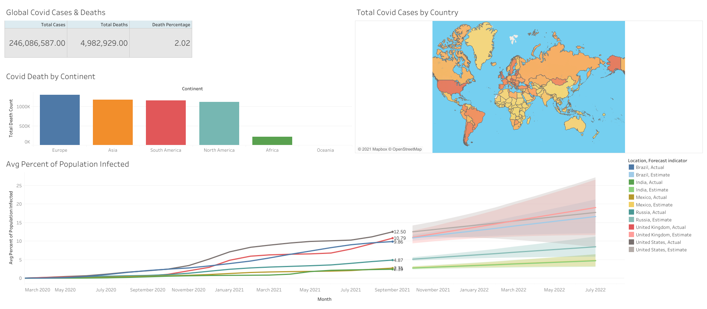

# Covid EDA & Visualizations

## Table of Cotents

* [Overview](#overview)
* [Data Understanding](#data-understanding)
* [Exploratory Data Analysis](#data-preparation)
* [Visualizations](#model-training-and-testing)

## Overview

Covid 19 has had a devastating impact on the world. It has changed the way of life for the world and has had a terrible cost on human life. This project is a preliminary analysis of how Covid has affected the world on a macro level examining case and death count and percentages on a global, continent, and country level as of October 31st, 2021.

## Data Understanding

The dataset comes from [Our World in Data](https://ourworldindata.org/covid-deaths) which allows you to specify the time range for the data that you want.

## Exploratory Data Analysis

## Visualizations

